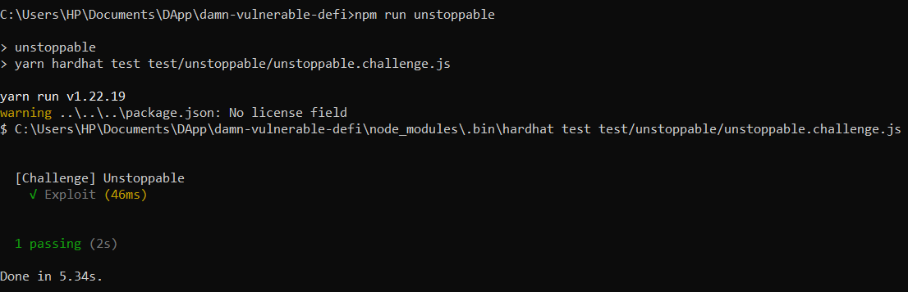
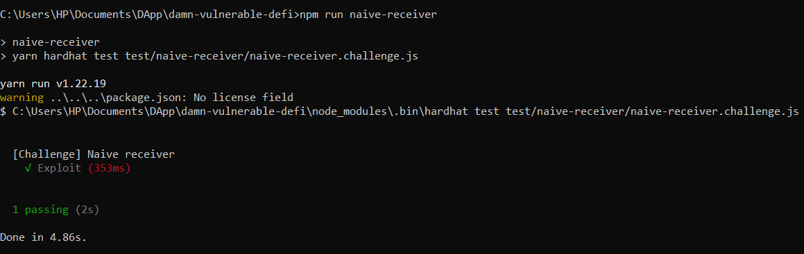
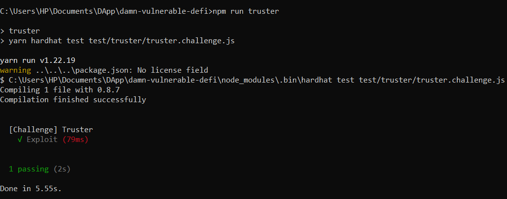
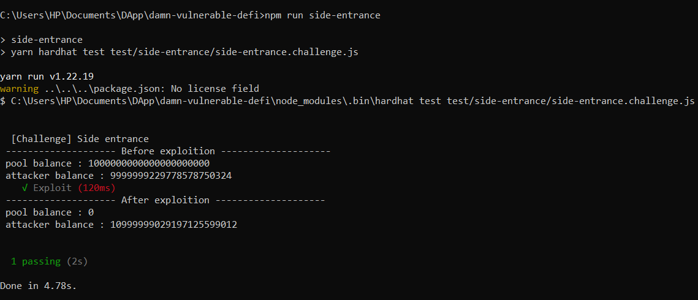

# **A set of challenges to learn offensive security of smart contracts in Ethereum.**
Visit [damnvulnerabledefi.xyz](https://damnvulnerabledefi.xyz)  
the result of tests that I've written are shown below .

## unstoppable

## naive-receiver

 
## truster

## side-entrance

